# Practical-1: Kotlin Programming Concepts

## AIM & Objective
Develop Kotlin programs to demonstrate various programming concepts including:
- Variables and Data Types
- Type Conversion
- Student Information Input/Output
- Control Flow (Odd/Even, Month Name)
- Functions and Recursion
- Arrays and ArrayList
- Classes and Constructors
- Operator Overloading
- Matrix Operations

---

## Tasks

### 1.1 Store & Display Values in Different Variables
Create and display variables of different data types: Integer, Double, Float, Long, Short, Byte, Char, Boolean, and String.  
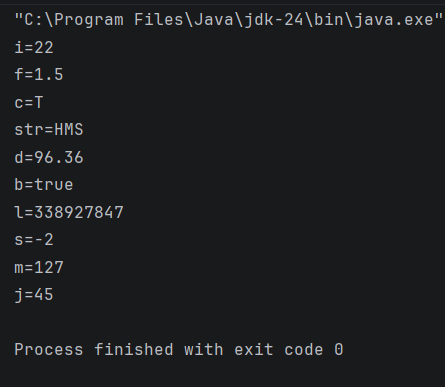

### 1.2 Type Conversion
Perform type conversions such as Integer → Double, String → Integer, and String → Double.  
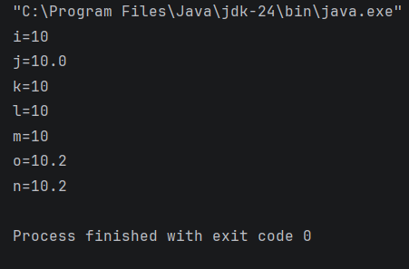

### 1.3 Scan Student’s Information and Display All Data
Input and display student details including name, enrollment number, branch, etc.  
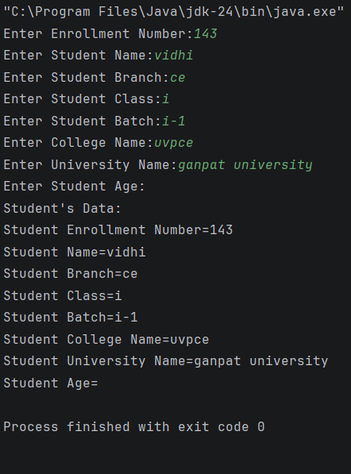

### 1.4 Check Odd or Even Numbers
Determine whether a number is odd or even using control flow within `println()`.  
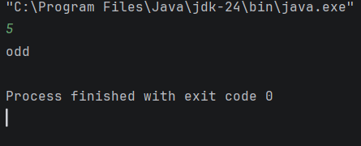

### 1.5 Display Month Name
Use a `when` expression to display the month name based on user input.  
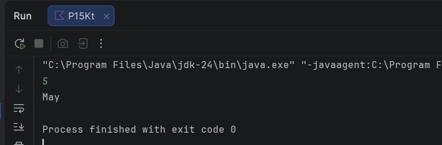

### 1.6 User-Defined Function
Create a user-defined function to perform arithmetic operations (addition, subtraction, multiplication, division).  
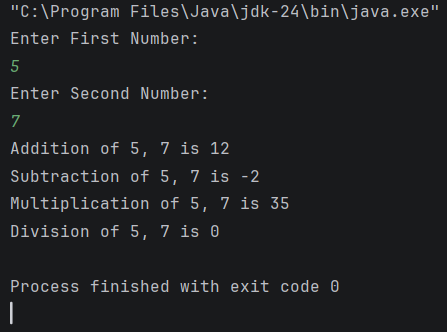

### 1.7 Factorial Calculation with Recursion
Calculate the factorial of a number using recursion.  
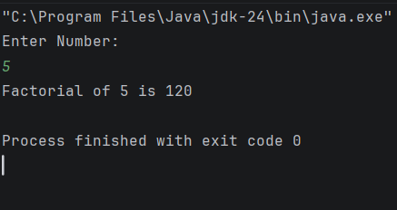

### 1.8 Working with Arrays
Explore array operations (`Arrays.deepToString()`, `contentDeepToString()`, `IntArray.joinToString()`).  
Use loops (`range`, `downTo`, `until`) and sort arrays both manually and with built-in functions.  
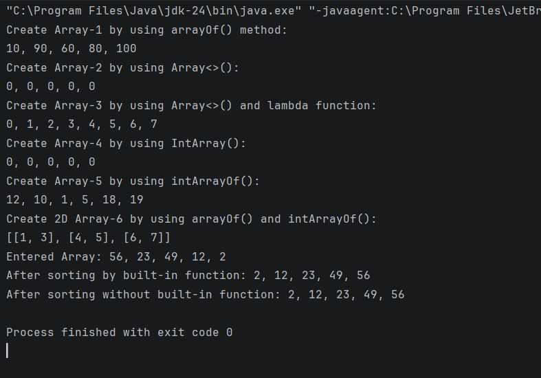

### 1.9 Find Maximum Number from ArrayList
Write a program to find the maximum number from an ArrayList of integers.  
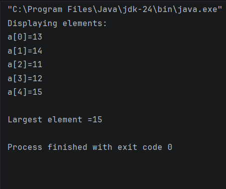

### 1.10 Class and Constructor Creation
Define classes and constructors.  
Create a `Car` class with properties (type, model, price, owner, miles driven).  
Implement functions to get car information, original price, current price, and display details.  
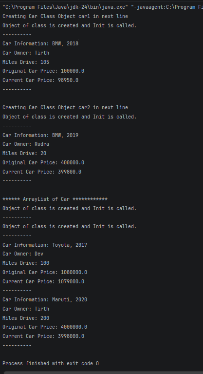

### 1.11 Operator Overloading and Matrix Operations
Explain operator overloading.  
Implement matrix addition, subtraction, and multiplication using a `Matrix` class.  
Override `toString()` for customized matrix output.  
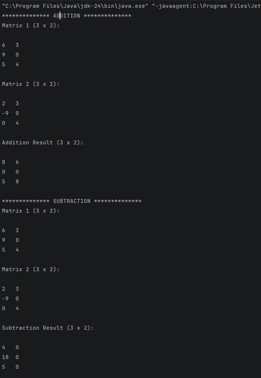  
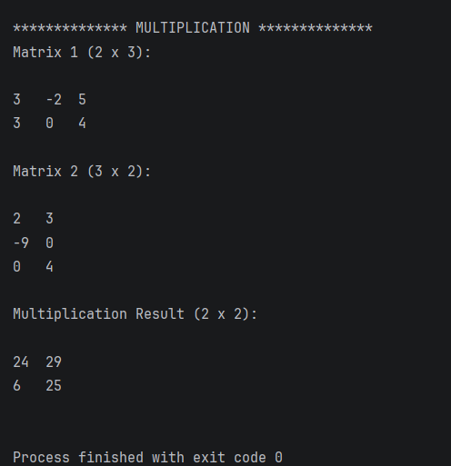

---

## Student Details
- **Enrollment No:** 24012011143
- **Practical:** 01
- **Subject:** Mobile Application Development (MAD)

---

## Conclusion
Successfully implemented various Kotlin programming concepts including:
- Variables and Type Conversion
- User Input and Control Flow
- Functions and Recursion
- Arrays and ArrayList
- Classes and Constructors
- Operator Overloading and Matrix Operations
